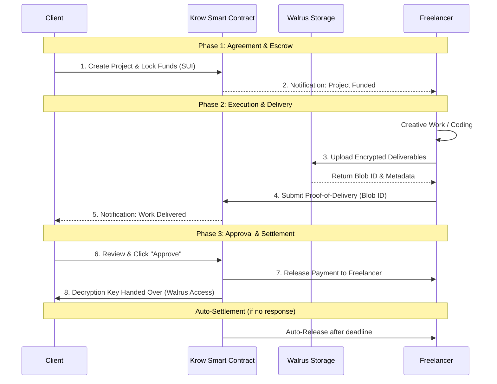
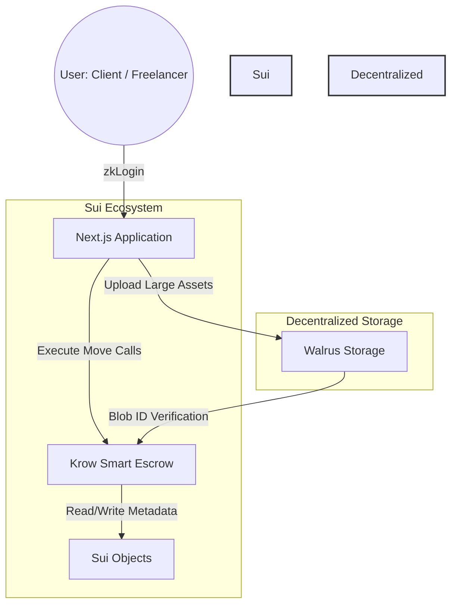

  

<h1 align="center">KROW</h1>

  <strong>Programmable Trust for Global Freelance Work</strong>

  The escrow layer the freelance economy never had — 
  where code enforces agreements, Walrus stores the proof, and no one can lie about what was delivered.

  
  
  
  

  <a href="#-the-problem-the-trust-gap-in-global-freelancing">Problem</a> •
  <a href="#-the-solution-krow-infrastructure">Solution</a> •
  <a href="#-mvp-scope-hackathon-submission">MVP Scope</a> •
  <a href="#️-tech-stack">Tech Stack</a> •
  <a href="#-roadmap">Roadmap</a>

---

> *"A freelancer in Bandung. A client in Berlin. Two strangers. Zero trust. One smart contract."*

---

## 🔴 The Problem: The "Trust Gap" in Global Freelancing

Imagine a graphic designer in Bandung spending two weeks crafting a complete branding kit for a client overseas. She delivers the final files. The client goes silent — forever. The platform? Offers a 14-day "investigation" and closes the case with no resolution.

Now flip it. A startup founder wires full payment upfront to a developer for a custom web app. Three weeks later, he receives a barely-modified free template with his logo slapped on it. Dispute filed. Arbitration takes a month. Outcome: inconclusive.

**Both sides lost. The platform in the middle took 20% and walked away clean.**

This is the reality of the $450B+ global freelance economy — an industry still running on handshakes, hope, and centralized platforms that profit from trust without actually providing it.

The core issues have never been solved:

- **Ghosting After Delivery** — Clients vanish once they receive the work, leaving freelancers with nothing but proof they were scammed.
- **Payment Without Guarantee** — Clients pay upfront with no enforceable way to ensure quality or completion.
- **Predatory Platform Fees** — 10–20% cuts on every transaction, yet disputes are still resolved by humans with inherent bias.
- **No Immutable Proof** — When conflict arises, neither side has cryptographic, timestamped evidence of *what* was delivered and *when*.
- **Cross-Border Payment Friction** — International transfers take days, bleed value through exchange rates, and exclude the unbanked entirely.

The problem isn't that freelancers and clients are dishonest.
**The problem is that the system was never designed to make honesty enforceable.**

---

## 🟢 The Solution: KROW Infrastructure

KROW replaces "Centralized Trust" with **"Programmable Trust."**

---

### 🧠 Sui — The Brain (Smart Escrow)

Every project on KROW is a **Sui Object**.

- **Non-Custodial Escrow:** Funds are locked in a smart contract, not held by a company.
- **Programmable Logic:** Payments are released automatically based on milestones, deadlines, or multisig approvals.
- **Fast & Cheap:** Leveraging Sui's parallel execution for near-instant agreement updates.

---

### 🛡️ Walrus — The Vault (Encrypted Proof-of-Delivery)

Large deliverables (source code, 4K video, high-res designs) are stored on **Walrus**.

- **Cryptographic Evidence:** Freelancers upload work to Walrus, generating a permanent Blob ID recorded on-chain.
- **Encrypted Access:** Files are encrypted; the decryption key is only released via the Sui smart contract once the client approves or a milestone is met.
- **Immutability:** Clients cannot claim "I didn't receive the file" if the Blob ID is permanently recorded on-chain.

---

### 💹 DeepBook — The Bank (Instant Settlement)

Global work needs global currency flexibility.

- **Cross-Token Payments:** A client can pay in SUI, while the freelancer receives USDC or their preferred stablecoin.
- **Deep Liquidity:** DeepBook handles the back-end conversion instantly with minimal slippage, protecting freelancers from crypto volatility.

---

## ✨ Key Features

- **zkLogin Onboarding** — Log in using Google/Apple/Twitch. No seed phrases required. Feels like any Web2 app.
- **Sponsored Transactions** — Gas fees can be covered by clients or brands, removing all crypto friction for new users.
- **Milestone-Based Payments** — Funds are released in stages as work progresses, protecting both sides throughout the project.
- **Immutable Timeline** — Every revision, message, and delivery is timestamped on-chain, creating undeniable evidence in case of disputes.
- **Auto-Settlement** — If a client does not "Approve" or "Dispute" within a set timeframe, funds are automatically released to the freelancer. No more ghosting.

---

## 🛠️ Tech Stack

| Layer | Technology | Role |
|---|---|---|
| **Blockchain** | Sui Network | Logic, escrow, and ownership |
| **Storage** | Walrus | Decentralized storage for large deliverables |
| **Liquidity** | DeepBook (CLOB) | Instant token conversion and settlement |
| **Smart Contracts** | Sui Move | Programmable escrow and project objects |
| **Frontend** | Next.js 14 / TypeScript | Core application UI |
| **Styling** | Tailwind CSS | Modern and responsive design |
| **Authentication** | Sui zkLogin | Seamless Web2-to-Web3 onboarding |

---

## 🔄 How It Works

1. **Agreement** — Client creates a project, defines milestones, and locks SUI into the KROW Escrow Contract.
2. **Execution** — Freelancer starts working. Progress is tracked via on-chain milestones.
3. **Delivery** — Freelancer uploads the final asset to Walrus. The system generates an encrypted Blob ID and records proof on Sui.
4. **Verification** — Client receives a notification and can review the deliverable.
5. **Settlement** — Client clicks "Approve" → payment is released and the decryption key is automatically handed to the client.

> If the client does not respond within the deadline, **Auto-Settlement** triggers and the freelancer is paid automatically.

---

## 🎯 MVP Scope (Hackathon Submission)

This hackathon submission focuses on demonstrating the core trust mechanism of KROW — the complete escrow lifecycle between a client and freelancer.

**What works in the MVP:**

- ✅ **Project Creation** — Client creates a project, defines milestones, and locks SUI into the KROW escrow smart contract
- ✅ **Proof-of-Delivery** — Freelancer uploads deliverable to Walrus, generating an on-chain Blob ID as cryptographic proof
- ✅ **Approval & Release** — Client reviews and clicks "Approve" to release payment directly to the freelancer
- ✅ **Auto-Settlement** — If client does not respond within a defined timeframe, funds are automatically released to the freelancer
- ✅ **Basic Frontend** — Next.js interface connected to Sui Testnet with zkLogin for seamless onboarding

**Intentionally out of scope for MVP:**

- Cross-token swaps via DeepBook *(Phase 2)*
- Dispute resolution mechanism *(Phase 3)*
- On-chain reputation system *(Phase 4)*

---

## 🗺️ Roadmap

### ✅ Phase 1 — Core Escrow & Proof-of-Delivery *(Hackathon MVP)*
The foundation of KROW. A working escrow contract on Sui with Walrus-backed proof-of-delivery and a functional frontend on testnet.

### 🔲 Phase 2 — Multi-Currency Settlement via DeepBook
Integrate DeepBook CLOB to allow clients to pay in SUI while freelancers receive USDC or their preferred stablecoin — instantly and with minimal slippage.

### 🔲 Phase 3 — Transparent Dispute Resolution
A community-based arbitration system where on-chain evidence (Walrus-stored deliverables, timestamped messages) is reviewed by a decentralized panel. Verifiable, transparent, and bias-resistant.

### 🔲 Phase 4 — On-Chain Reputation System
An immutable freelancer CV built from verified project completions. Every successful delivery contributes to a reputation score that cannot be faked or deleted.

---

## 📊 Project Workflow

### 1. Interaction Flow

---

### 2. Technical Architecture

---

## 📈 Scalability & Sustainability

- **Architecture** — Built using Sui's object-centric model, allowing the platform to handle thousands of concurrent projects without congestion.
- **Cost Efficiency** — Walrus provides significantly cheaper decentralized storage compared to on-chain alternatives.
- **Adoption** — Designed with a "Web2-first" UX focus to capture the 99% of freelancers who aren't yet in crypto.

---

## 💡 Lessons Learned

- **Sui Move's** object-centric asset model makes escrow logic significantly safer than EVM-based account models — ownership is explicit and non-custodial by design.
- **Walrus** solves the "Proof of Delivery" problem that has plagued Web3 freelance platforms — large files can now be stored verifiably and accessed conditionally.
- **UX is King** — For real-world adoption, the blockchain must stay invisible. zkLogin and sponsored transactions are not optional extras; they are core to onboarding the next billion users.

---

Built for the **Lofi the Yeti Hackathon** 🏔️

*Bridging creative freedom with programmable trust.*

